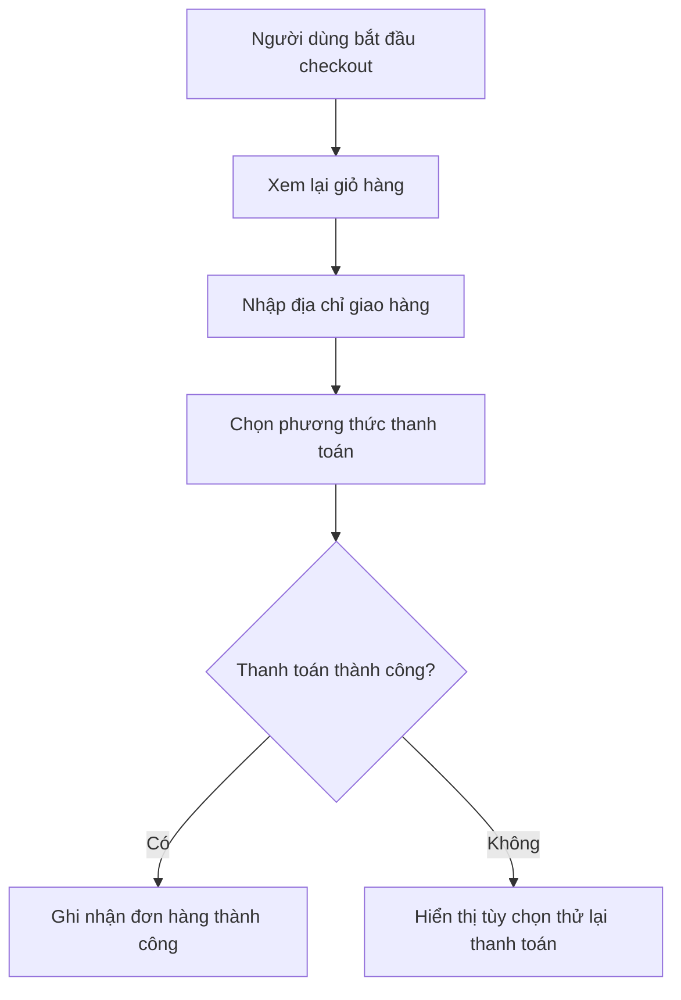
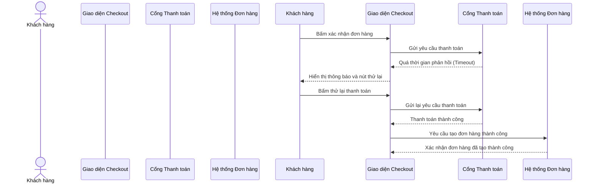

# Các đoạn mã biểu đồ Mermaid mẫu (Mermaid Snippets)

## Sơ đồ hoạt động (Activity Flow)

```mermaid
flowchart TD
    A[Người dùng bắt đầu checkout] --> B[Xem lại giỏ hàng]
    B --> C[Nhập địa chỉ giao hàng]
    C --> D[Chọn phương thức thanh toán]
    D --> E{Thanh toán thành công?}
    E -- Có --> F[Ghi nhận đơn hàng thành công]
    E -- Không --> G[Hiển thị tùy chọn thử lại thanh toán]
```

## Sơ đồ trình tự (Sequence Diagram)

```mermaid
sequenceDiagram
    actor Shopper as Khách hàng
    participant UI as Giao diện Checkout
    participant Pay as Cổng Thanh toán
    participant Ord as Hệ thống Đơn hàng

    Khách hàng->>Giao diện Checkout: Bấm xác nhận đơn hàng
    Giao diện Checkout->>Cổng Thanh toán: Gửi yêu cầu thanh toán
    Cổng Thanh toán-->>Giao diện Checkout: Quá thời gian phản hồi (Timeout)
    Giao diện Checkout-->>Khách hàng: Hiển thị thông báo và nút thử lại
    Khách hàng->>Giao diện Checkout: Bấm thử lại thanh toán
    Giao diện Checkout->>Cổng Thanh toán: Gửi lại yêu cầu thanh toán
    Cổng Thanh toán-->>Giao diện Checkout: Thanh toán thành công
    Giao diện Checkout->>Hệ thống Đơn hàng: Yêu cầu tạo đơn hàng thành công
    Hệ thống Đơn hàng-->>Giao diện Checkout: Xác nhận đơn hàng đã tạo thành công
```
