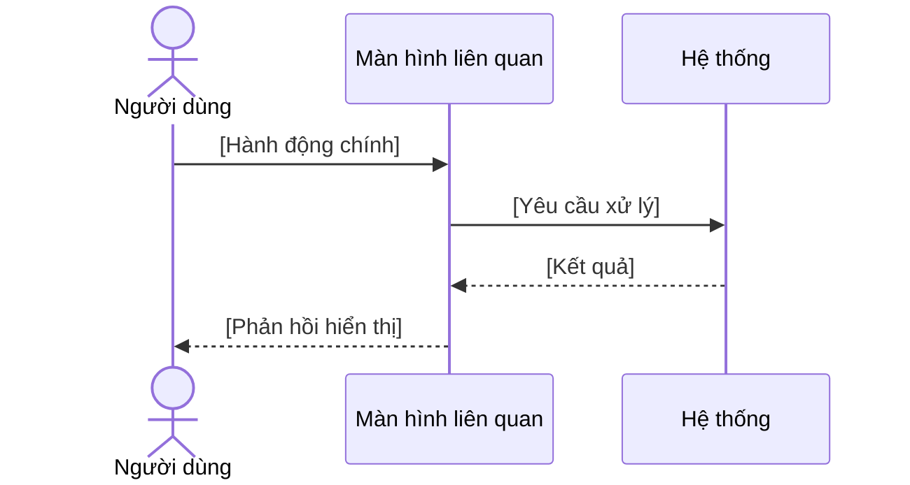

# Khung mô tả Ca sử dụng (Use Case Template)

## Tên ca sử dụng (Use case name)

## Mã ca sử dụng (Use case ID)

- [UC-{FLOW}-01]

## Mục tiêu (Goal)

## Tác nhân chính (Primary actor)

## Điều kiện tiên quyết (Preconditions)

- [Ví dụ: Người dùng đã có ít nhất một sản phẩm trong giỏ hàng]

## Luồng sự kiện chính (Main flow)

1. [Ví dụ: Người dùng bấm nút xác nhận thanh toán]
2. [Hệ thống kiểm tra thông tin và gọi cổng thanh toán]

## Luồng sự kiện thay thế (Alternate flows)

- [Ví dụ: Người dùng nhập mã giảm giá hợp lệ -> Hệ thống cập nhật lại số tiền]

## Luồng xử lý ngoại lệ (Exception flows)

- [Ví dụ: Giao dịch thanh toán bị từ chối -> Hệ thống báo lỗi và cho phép thử lại]

## Điều kiện sau khi thực hiện (Postconditions)

- [Ví dụ: Đơn hàng được tạo thành công ở trạng thái đã thanh toán]

## Sơ đồ trình tự (Sequence diagram)

## Truy vết (Traceability)

| Loại | ID liên quan | Liên kết nghiệp vụ |
|---|---|---|
| Màn hình | [CHK-{SCREEN}-01] | [Hành động trùng wording với luồng UC] |
| Câu chuyện người dùng | [US-{FLOW}-01] | [Giá trị được đáp ứng] |
| Thông báo | [MSG-{TYPE}-01] | [Ngoại lệ hoặc validation tương ứng] |
