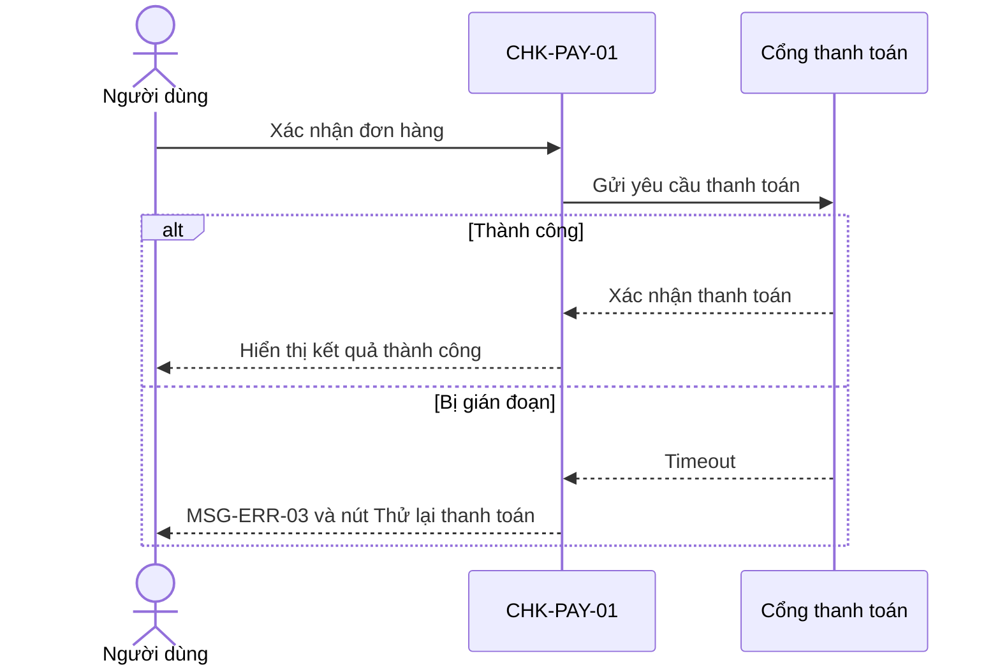

# Bộ hồ sơ tài liệu BA thu nhỏ mẫu (Sample Mini BA Pack)

## 1. Nguồn và phạm vi

- **Nguồn:** Brief và flow checkout trong bộ học liệu.
- **Lưu ý:** Checkout/eCommerce trong file này chỉ là scenario minh họa để học viên thấy cách hợp nhất và truy vết; skill và template không bắt buộc nghiệp vụ eCommerce.
- **Phạm vi:** Guest checkout có email nhận hóa đơn, xác nhận thông tin giao hàng và phí vận chuyển, lựa chọn thanh toán, COD dưới 3.000.000 VND, xử lý thanh toán bị gián đoạn.
- **Giả định:** Kết nối Figma MCP đã tạo frame `figma://checkout/payment-step/CHK-PAY-01`.
- **Câu hỏi mở:** Không có trong bài mẫu.

## 2. Giao diện phác thảo và ghi chú

### CHK-PAY-01 - Bước thanh toán đơn hàng

- **Tham chiếu Figma MCP:** `figma://checkout/payment-step/CHK-PAY-01`
- **Mục đích:** Cho phép người dùng chọn phương thức thanh toán và xác nhận đơn hàng.
- **Trường/khối:** Email nhận hóa đơn, Địa chỉ nhận hàng, Hình thức vận chuyển và phí vận chuyển, Mã giảm giá, Phương thức thanh toán, Tóm tắt đơn hàng.
- **Hành động:** `Áp dụng mã giảm giá`, `Chọn phương thức thanh toán`, `Xác nhận đơn hàng`, `Thử lại thanh toán`.
- **Trạng thái cần thể hiện:** mặc định, mã giảm giá không hợp lệ, COD không khả dụng, thanh toán bị gián đoạn.

## 3. Thông tin màn hình (Screen info)

- **Tên màn hình:** Bước thanh toán đơn hàng
- **Mã màn hình:** CHK-PAY-01
- **Ca sử dụng liên quan:** UC-CHECKOUT-01

## Hành động của người dùng

| Hành động | Điều kiện kích hoạt | Kết quả xử lý | Bước UC |
|---|---|---|---|
| Chọn phương thức thanh toán | Người dùng chọn COD hoặc thẻ | Hệ thống lưu lựa chọn hợp lệ | UC-CHECKOUT-01 / 2 |
| Áp dụng mã giảm giá | Người dùng nhập mã và chọn `Áp dụng` | Hệ thống kiểm tra mã và cập nhật tổng thanh toán hoặc báo lỗi | UC-CHECKOUT-01 / A1 |
| Xác nhận đơn hàng | Người dùng chọn nút `Xác nhận đơn hàng` | Hệ thống gửi yêu cầu thanh toán | UC-CHECKOUT-01 / 4 |
| Thử lại thanh toán | Thanh toán bị gián đoạn | Hệ thống gửi lại yêu cầu | UC-CHECKOUT-01 / E1 |

## Danh sách trường dữ liệu

| Trường dữ liệu | Kiểu hiển thị | Bắt buộc | Ghi chú |
|---|---|---|---|
| Email nhận hóa đơn | Read-only text | Có | Email hợp lệ từ guest checkout để nhận hóa đơn điện tử |
| Địa chỉ nhận hàng | Read-only panel | Có | Thông tin đã xác nhận ở bước giao hàng |
| Hình thức vận chuyển và phí vận chuyển | Read-only panel | Có | Phải hiển thị trước khi xác nhận đơn hàng |
| Mã giảm giá | Text input | Không | Chỉ áp dụng một mã |
| Phương thức thanh toán | Radio group | Có | COD bị vô hiệu hóa từ 3.000.000 VND |
| Tóm tắt đơn hàng | Read-only panel | Có | Hiển thị tổng thanh toán |

## Quy tắc hiển thị

- COD hiển thị bị vô hiệu hóa khi tổng đơn hàng từ 3.000.000 VND.
- Email nhận hóa đơn, địa chỉ nhận hàng, hình thức vận chuyển và phí vận chuyển hiển thị trước nút `Xác nhận đơn hàng`.

## Quy tắc tương tác và hành vi

- Nút `Xác nhận đơn hàng` chỉ khả dụng khi có phương thức thanh toán hợp lệ.
- Khi thanh toán bị gián đoạn, màn hình hiển thị nút `Thử lại thanh toán`.
- Người mua kiểm tra thông tin giao hàng và phí vận chuyển hiển thị trước khi xác nhận đơn hàng.

## Quy tắc kiểm tra tính hợp lệ dữ liệu

- Mã giảm giá không hợp lệ hiển thị `MSG-ERR-01`.
- Chưa chọn phương thức thanh toán hiển thị `MSG-ERR-02`.

## Các trạng thái màn hình

- **Mặc định:** Hiển thị các lựa chọn thanh toán.
- **Lỗi:** Hiển thị thông báo và hành động sửa lỗi.
- **Thành công:** Chuyển sang xác nhận đơn hàng.
- **Không khả dụng:** COD bị vô hiệu hóa theo hạn mức.

## Thông báo hệ thống

| Mã thông báo | Nội dung chính xác |
|---|---|
| MSG-ERR-01 | Mã giảm giá không hợp lệ hoặc đã hết hạn sử dụng. |
| MSG-ERR-02 | Vui lòng lựa chọn phương thức thanh toán. |
| MSG-INF-01 | COD không áp dụng cho đơn hàng có giá trị từ 3.000.000 VND trở lên. |
| MSG-ERR-03 | Giao dịch thanh toán bị gián đoạn. Vui lòng thử lại. |

## 4. Sơ đồ trình tự

## 5. Ca sử dụng (Use case) - UC-CHECKOUT-01

### Mục tiêu

Hoàn tất đơn hàng với phương thức thanh toán hợp lệ.

### Tác nhân chính

Người mua hàng.

### Điều kiện tiên quyết

- Người mua đã có sản phẩm trong giỏ hàng và đang ở CHK-PAY-01.
- Người mua guest checkout đã cung cấp email hợp lệ; địa chỉ nhận hàng và hình thức vận chuyển đã được ghi nhận để hiển thị kiểm tra.

### Luồng sự kiện chính

1. Hệ thống hiển thị email nhận hóa đơn, địa chỉ nhận hàng, hình thức vận chuyển và phí vận chuyển để người mua kiểm tra.
2. Người mua chọn phương thức thanh toán.
3. Hệ thống xác nhận phương thức thanh toán hợp lệ.
4. Người mua chọn `Xác nhận đơn hàng`.
5. Hệ thống xử lý thanh toán và ghi nhận đơn hàng thành công.

### Luồng sự kiện thay thế

- A1. Người mua nhập mã giảm giá hợp lệ; hệ thống cập nhật tổng thanh toán.

### Luồng xử lý ngoại lệ

- E1. Cổng thanh toán bị gián đoạn; hệ thống hiển thị `MSG-ERR-03` và cho phép `Thử lại thanh toán`.

### Điều kiện sau khi thực hiện

- Đơn hàng được ghi nhận thành công hoặc vẫn chờ thanh toán để người mua thử lại.

## 6. Câu chuyện người dùng và Tiêu chí nghiệm thu (Acceptance Criteria)

### US-CHECKOUT-01 - Thanh toán đơn hàng

**Là** người mua hàng, **Tôi muốn** chọn phương thức thanh toán và xác nhận đơn hàng, **Để** hoàn tất việc mua hàng.

#### AC-CHECKOUT-01 - Xác nhận đơn hàng thành công

- **Story liên quan:** US-CHECKOUT-01
- **Cho (Given):** Người mua đang ở CHK-PAY-01 và đã chọn phương thức hợp lệ.
- **Khi (When):** Người mua chọn `Xác nhận đơn hàng`.
- **Thì (Then):** Hệ thống ghi nhận đơn hàng thành công.

#### AC-CHECKOUT-02 - Thử lại khi thanh toán bị gián đoạn

- **Story liên quan:** US-CHECKOUT-01
- **Cho (Given):** Cổng thanh toán không phản hồi kịp thời.
- **Khi (When):** Hệ thống nhận kết quả timeout.
- **Thì (Then):** CHK-PAY-01 hiển thị `MSG-ERR-03` và nút `Thử lại thanh toán`.

#### AC-CHECKOUT-03 - Không cho chọn COD khi vượt hạn mức

- **Story liên quan:** US-CHECKOUT-01
- **Cho (Given):** Tổng giá trị đơn hàng từ 3.000.000 VND trở lên.
- **Khi (When):** CHK-PAY-01 hiển thị danh sách phương thức thanh toán.
- **Thì (Then):** Tùy chọn COD bị vô hiệu hóa và hiển thị `MSG-INF-01`.

#### AC-CHECKOUT-04 - Kiểm tra thông tin giao hàng trước xác nhận

- **Story liên quan:** US-CHECKOUT-01
- **Cho (Given):** Người mua guest checkout đã cung cấp email hợp lệ và thông tin giao hàng.
- **Khi (When):** Người mua xem CHK-PAY-01 trước khi xác nhận đơn hàng.
- **Thì (Then):** Màn hình hiển thị email nhận hóa đơn, địa chỉ nhận hàng, hình thức vận chuyển và phí vận chuyển.

## 7. Checklist kiểm duyệt chất lượng

- [x] Hành động `Xác nhận đơn hàng` giống nhau trong CHK-PAY-01 và UC-CHECKOUT-01.
- [x] `MSG-ERR-03` dùng cùng nội dung trong screen spec và kịch bản kiểm thử.
- [x] `MSG-INF-01` giải thích trạng thái COD không khả dụng giống screen spec nguồn.
- [x] AC-CHECKOUT-01 đến AC-CHECKOUT-04 có test case tương ứng.

## 8. Kịch bản kiểm thử (Test case)

| Mã Test Case (Test ID) | AC liên quan | Màn hình | Kịch bản kiểm thử (Scenario) | Điều kiện tiên quyết (Preconditions) | Các bước thực hiện (Steps) | Kết quả kỳ vọng (Expected Result) | Độ ưu tiên |
|---|---|---|---|---|---|---|---|
| TC-CHECKOUT-01 | AC-CHECKOUT-01 | CHK-PAY-01 | Xác nhận đơn hàng thành công | Đã chọn phương thức hợp lệ | Chọn `Xác nhận đơn hàng` | Đơn hàng được ghi nhận thành công | Cao |
| TC-CHECKOUT-02 | AC-CHECKOUT-02 | CHK-PAY-01 | Thanh toán bị gián đoạn | Cổng thanh toán timeout | Chọn `Xác nhận đơn hàng` | Hiển thị `MSG-ERR-03`: Giao dịch thanh toán bị gián đoạn. Vui lòng thử lại. | Cao |
| TC-CHECKOUT-03 | AC-CHECKOUT-03 | CHK-PAY-01 | COD không khả dụng khi vượt hạn mức | Tổng đơn hàng bằng 3.000.000 VND | Mở màn hình thanh toán | Hiển thị `MSG-INF-01`: COD không áp dụng cho đơn hàng có giá trị từ 3.000.000 VND trở lên. | Cao |
| TC-CHECKOUT-04 | AC-CHECKOUT-04 | CHK-PAY-01 | Hiển thị thông tin giao hàng trước xác nhận | Guest checkout có email và lựa chọn giao hàng hợp lệ | Mở màn hình thanh toán | Hiển thị email nhận hóa đơn, địa chỉ nhận hàng, hình thức vận chuyển và phí vận chuyển trước nút `Xác nhận đơn hàng` | Cao |

## 9. Ma trận truy vết

| Màn hình | Use Case | User Story | Acceptance Criteria | Test Case | Message |
|---|---|---|---|---|---|
| CHK-PAY-01 | UC-CHECKOUT-01 | US-CHECKOUT-01 | AC-CHECKOUT-01 | TC-CHECKOUT-01 | - |
| CHK-PAY-01 | UC-CHECKOUT-01 | US-CHECKOUT-01 | AC-CHECKOUT-02 | TC-CHECKOUT-02 | MSG-ERR-03 |
| CHK-PAY-01 | UC-CHECKOUT-01 | US-CHECKOUT-01 | AC-CHECKOUT-03 | TC-CHECKOUT-03 | MSG-INF-01 |
| CHK-PAY-01 | UC-CHECKOUT-01 | US-CHECKOUT-01 | AC-CHECKOUT-04 | TC-CHECKOUT-04 | - |
